# Docker with Run:ai (with Jupyter example)  
  
**A 16-minute video of a live demo can be found [here](https://vimeo.com/745874951)**  
  
Presentation files can be found [here](/docs)  
    
## Docker Intro 

### What is Docker?  

+ Docker is a way to create “images.”
+ Image have an OS (usually linux) and software installed on them
+ Images can be run on any hardware as “containers” 

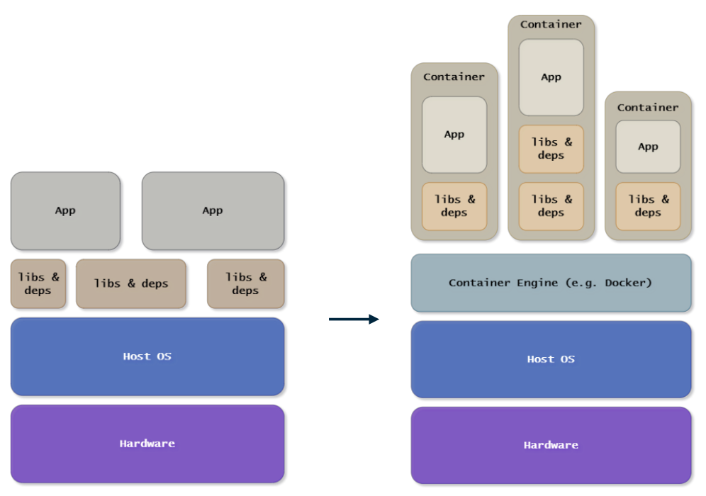  
  
### Why use Docker?

Let's say that we have 3 users, and each requires different software to run their code:
+ User 1 Code Requires
    + Cudatoolkit=11.2
    + Python=3.7
+ User 2 Code Requires
    + Cudatoolkit=11.7
    + Python=3.9
+ User 3 Code Requires
    + Cudatoolkit=11.5
    + Python=3.8

Each user can create an image with the software they need installed on it....  
  
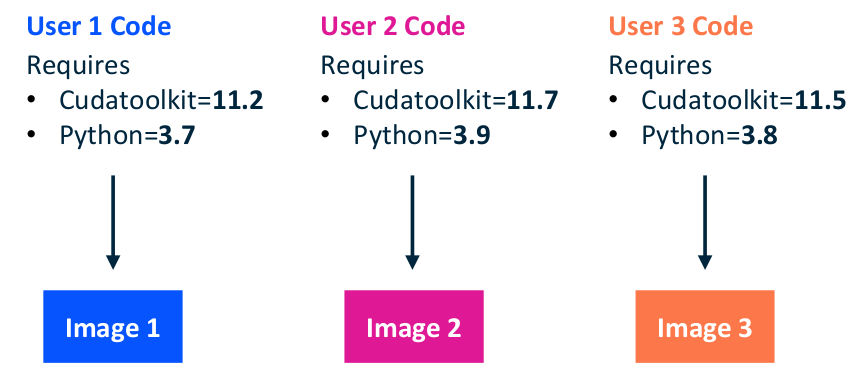  
  
... and simply run the image inside a container on any hardware with docker engine running. 
  
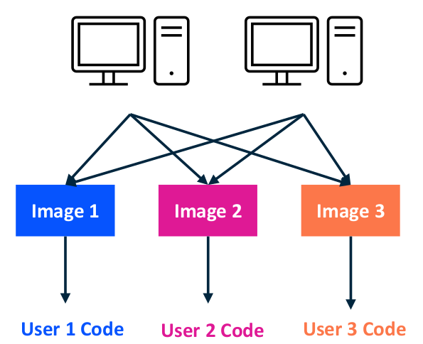  
  
### What do I need to use Docker?
  
1. An image repository
    + I use Docker Hub. It's free and you can register [here](https://hub.docker.com/)
  
  
  
2. Docker software
    + I use Docker Desktop
        + Here are the instructions for a [Linux installation](https://docs.docker.com/desktop/install/linux-install/)
        + Here are the instructions for a [Windows installation](https://docs.docker.com/desktop/install/windows-install/)
        + Here are the instructions for a [Mac installtion](https://docs.docker.com/desktop/install/mac-install/)
  
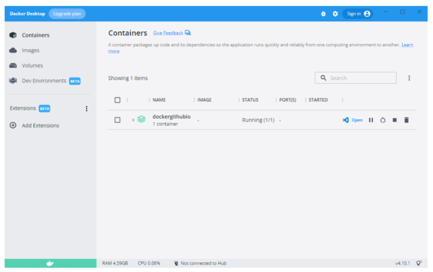  
  
### How do I make a Docker image? 
  
  
  
  
  
6. Run this command to buid  
~~~bash
docker build -t {your-docker-hub-username}/{your-image-name}:{version-number} .
~~~  
(this is what my command would be)
~~~bash
docker build -t jonathancosme/my-docker-image:1.0 .
~~~  
  
7. Run this to push to the repo
~~~bash
docker image push {your-docker-hub-username}/{your-image-name}:{version-number}
~~~  
(this is what my command would be)
~~~bash
docker image push jonathancosme/my-docker-image:1.0
~~~  
  
#### How I use my Docker image with Run:ai?  

  
  
Use the **-i** flag on the CLI to specify the image  
~~~bash
runai submit -i jonathancosme/my-image-name:1.0 {other arguments}
~~~  
  
#### What is a "dockerfile?"  
  
A “dockerfile” is a simple text file that tells docker how to build your image.  
There are 3 basic commands to use  
+ **FROM** - specifies the base image to use (**a starting point**)
+ **RUN** - specifies a command to run in a terminal. This is used **to install software**
+ **CMD** - specified the **default command** for the image to run, if no command is specified.  
(yes, these are case-sensitive, and must always be in caps)
  
 
  
A full list and explanation of the dockerfile commands can be found [here](https://docs.docker.com/engine/reference/builder/)  
  
In this particular image,  
  

  
#### About "layers"  
  
  
  
This image has **at least 4 layers**.  
Keep in mind that the **base image** (FROM command) **also has layers**, so our layers will be built on top of these.  
Essentially, we will **have number-of-layers-in-base-image + 3** layers.  
  
All else equal, **more layers make the image larger**.  
As a general rule, **we want images to be small**.  
Pay attention to how you create your layers  
  
  
  
When you create **a layer**, it **should accomplish a specific task**, rather than installing one software package  
  
When building images, **docker will “cache” layers that have not changed**; this **makes building faster**.  
**If a layer is changed, all layers after** it will need to **be re-built**.  
  
 

You want to structure your layers so that the **most-often change layers are at bottom**  
  
## Docker images with Run:ai (using Jupyter example)
  
### Key concepts
  
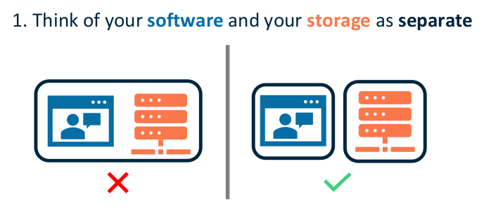  
  
  
  
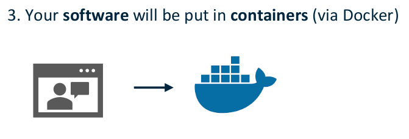  
  
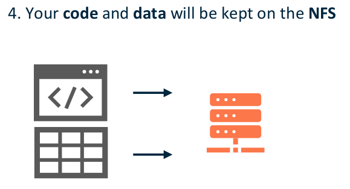  
  
The idea is that you will mount your NFS, then run a script that is stored on the NFS  
  
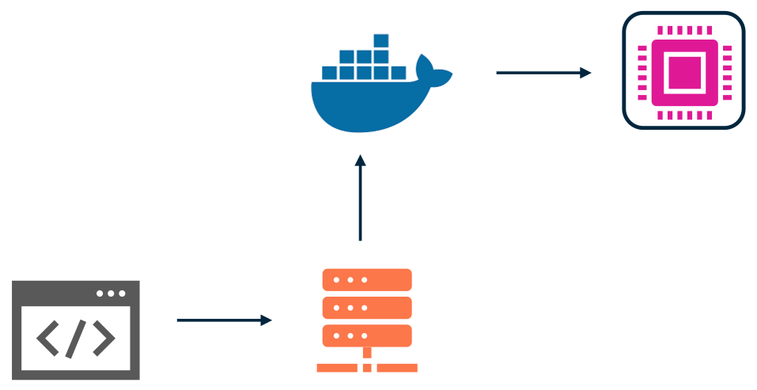 
  
### Jupyter
  
Jupyter Lab is a tool commonly used by data scientist.  
  
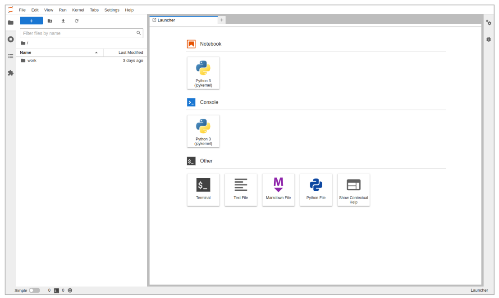 
  
For our example, we will use an official image which can be pulled with:  
**jupyter/base-notebook**  
  
### Jupyter on Run:ai
  
On the New Job UI:
1. Select **Interactive**
2. Specify Image as **jupyter/base-notebook**
3. Toggle the **Jupyter Notebook** option
Submit the job  
  
  
  
**After** the job **status changes to Running**, you can **connect** to the Jupyter Lab UI.  
  
  
  
If you navigate to the **work folder**, you’ll notice it’s **empty**.  
  
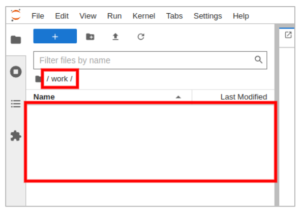  
  
### Jupyter on Run:ai **with mounted NFS**
  
We’ll **start with the same** options as before...  
  
On the New Job UI:
1. Select **Interactive**
2. Specify Image as **jupyter/base-notebook**
3. Toggle the **Jupyter Notebook** option  
  
  
  
... but this time, we’ll **mount** our NFS folder **to the “work” directory**.  
  
4. Under Storage, select **Add volume**
5. **Input** your **NFS directory** into the Source Path
6. **Input /home/jovyan/work** into the Target Path  
  
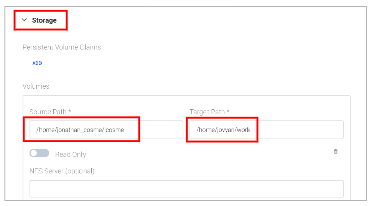  
  
**After** the job **status changes to Running**, you can **connect** to the Jupyter Lab UI.  
  
  
  
If you navigate to the **work folder**, you’ll notice that all **our files and folder are there**  
  
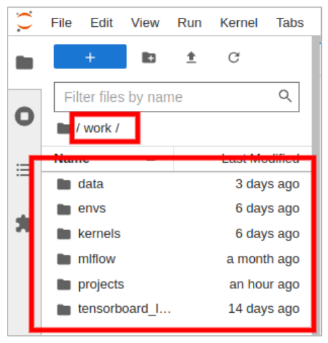  
  
## Docker with non-interactive jobs
  
### Running a non-interactive job  
  
Lets say that I had a script called **my_script.py**
  
  
  
This is the **content** of the python script:  
  
  
  
In order to run the script using the image:
1. Select **Training** type job
2. Specify the image as **jupyter/base-notebook**
3. **Mount** your **NFS** volume
4. **Add a Command** under Container Definition  
  
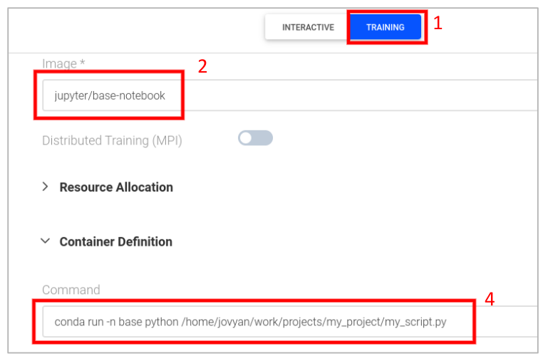  
  
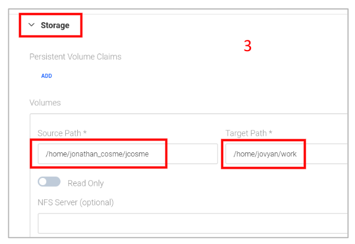  
  
In Command, under Container Definition, input:  
**conda run -n base python /home/jovyan/work/projects/my_project/my_script.py**  
  
Wait for the job status to change to Succeeded  
  
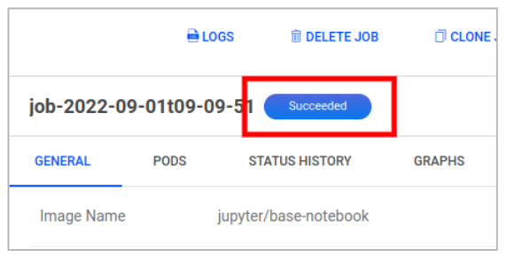  
  
In the Logs tab, you should see the output of my_script.py  
  
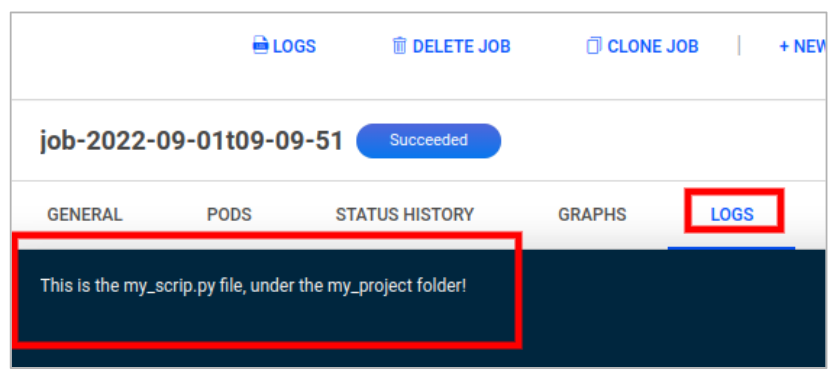  
  
## Closing notes  
  
### Some general Docker tips  

+ Use an official Docker image as a base image
    + They are more stable
+ Use a specific version (the more specific the better)
    + If no version is specified Docker will just take the latest version, which could break your image
+ If starting with a raw OS image, selected an image with a lean distribution.
    + For example, use Alpine over Ubuntu. Ubuntu contains a lot of software you won’t need.
  
### BE AWARE  

+ ONLY THE CONTENT OF THE FOLDER CONTAINING YOUR NFS MOUNT WILL BE SAVED/PERSIST
    + This means that ALL OTHER FILES that were created during the job session will be gone forever, once the job finishes
+ ANY SOFTWARE CHANGES (using apt/apt-get install or conda/mamba install/create) made while the job is running WILL NOT BE SAVED
    + If you want to make permanent software changes to the image, you will need to update the dockerfile, re-build it, and re-push it to Docker hub.
